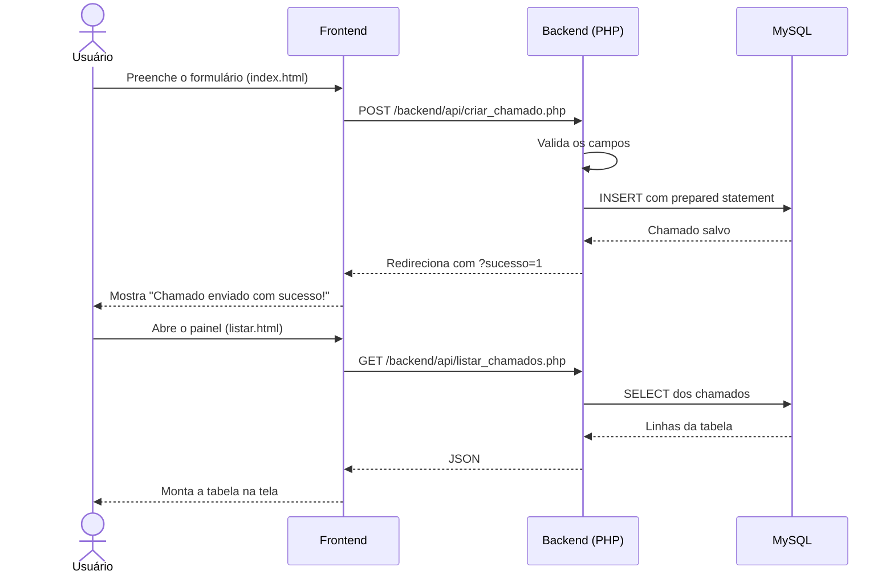

<div align="center">


<br>

<a href="https://github.com/eduardo-m-muller/helpdesk">
  
</a>

<br>


[Sobre](#-sobre-o-projeto) •
[Funcionalidades](#-funcionalidades) •
[Como funciona](#-como-funciona) •
[Instalação](#-instalação) •
[API](#-documentação-da-api) •
[Segurança](#-segurança) •
[Problemas comuns](#-problemas-comuns)

</div>

---

## 📖 Sobre o projeto

O **Helpdesk** é um sistema simples de chamados de suporte técnico. Quem precisa de ajuda preenche um formulário com o problema, e o técnico acompanha tudo em um painel, com os chamados mais novos primeiro e a prioridade destacada por cor.

O projeto é dividido em duas partes independentes:

- **Frontend:** as páginas que o usuário vê, feitas com HTML, CSS e JavaScript puro, sem frameworks.
- **Backend:** scripts PHP que conversam com o banco MySQL e entregam os dados para o frontend.

Essa divisão deixa fácil mexer no visual sem encostar na lógica do servidor, e o contrário também.

---

## ✨ Funcionalidades

| Recurso | O que faz |
| --- | --- |
| **Abertura de chamado** | Formulário com nome, título, prioridade e descrição do problema. |
| **Painel do técnico** | Tabela com todos os chamados, do mais novo para o mais antigo. |
| **Prioridade por cor** | Alta em vermelho, média em laranja e baixa em verde. |
| **Status automático** | Todo chamado nasce como `aberto`. |
| **Data automática** | O banco registra a data e a hora da criação. |
| **Mensagem de confirmação** | Depois de enviar, o formulário avisa que o chamado foi registrado. |
| **Validação** | O backend recusa campos vazios e prioridades que não existem. |

---

## 🔄 Como funciona

O fluxo completo, do formulário até o painel:



---

## 🗂 Estrutura do projeto

```
helpdesk/
├── assets/
│   └── banner.svg                 # banner animado deste README
├── frontend/                      # o que aparece na tela
│   ├── index.html                 # formulário para abrir chamado
│   ├── listar.html                # painel do técnico
│   ├── css/
│   │   └── style.css              # estilos das duas páginas
│   └── js/
│       ├── index.js               # mostra a mensagem de sucesso
│       └── listar.js              # busca os chamados e monta a tabela
├── backend/                       # o que roda no servidor
│   ├── api/
│   │   ├── criar_chamado.php      # salva um chamado novo
│   │   └── listar_chamados.php    # devolve os chamados em JSON
│   ├── config/
│   │   ├── conexao.exemplo.php    # modelo da conexão (vai pro Git)
│   │   └── conexao.php            # conexão real, com senha (fica fora do Git)
│   └── database/
│       └── banco.sql              # cria o banco e a tabela
└── README.md
```

> **Atenção:** o `conexao.php` está no `.gitignore` porque guarda a senha do banco. Depois de clonar o projeto, você precisa criá-lo a partir do `conexao.exemplo.php` (veja a [instalação](#-instalação)).

---

## 🛠 Tecnologias

| Camada | Tecnologia | Para que serve |
| --- | --- | --- |
| Frontend | HTML5 | Estrutura das páginas e do formulário. |
| Frontend | CSS3 | Visual do formulário, da tabela e das etiquetas de prioridade. |
| Frontend | JavaScript | `fetch` para buscar os dados e montar a tabela sem recarregar a página. |
| Backend | PHP 8 | Recebe o formulário, valida e conversa com o banco. |
| Backend | PDO | Acesso ao banco com prepared statements. |
| Banco | MySQL | Guarda os chamados. |

---

## 🚀 Instalação

### Pré-requisitos

- PHP 8 ou mais novo, com a extensão `pdo_mysql`
- MySQL ou MariaDB
- Git

No Debian, Ubuntu e Pop!_OS, dá para instalar tudo com:

```bash
sudo apt install php php-mysql mysql-server git
```

### 1. Clonar o repositório

```bash
git clone https://github.com/eduardo-m-muller/helpdesk.git
cd helpdesk
```

### 2. Criar o banco e a tabela

```bash
sudo mysql < backend/database/banco.sql
```

Esse comando cria o banco `db_helpdesk` e a tabela `chamados`.

### 3. Criar o usuário do banco

Entre no MySQL com `sudo mysql` e rode:

```sql
CREATE USER 'admin_helpdesk'@'localhost' IDENTIFIED BY 'escolha_uma_senha_forte';
GRANT ALL PRIVILEGES ON db_helpdesk.* TO 'admin_helpdesk'@'localhost';
FLUSH PRIVILEGES;
```

### 4. Configurar a conexão

Copie o arquivo de modelo e coloque a senha que você escolheu:

```bash
cp backend/config/conexao.exemplo.php backend/config/conexao.php
nano backend/config/conexao.php
```

### 5. Subir o servidor

**Rode sempre da pasta raiz do projeto** (a que contém `frontend/` e `backend/`):

```bash
php -S localhost:8000
```

### 6. Abrir no navegador

| Página | Endereço |
| --- | --- |
| Abrir chamado | http://localhost:8000/frontend/index.html |
| Painel do técnico | http://localhost:8000/frontend/listar.html |

---

## 🗄 Banco de dados

O banco se chama `db_helpdesk` e tem uma tabela só, a `chamados`:

| Coluna | Tipo | Descrição |
| --- | --- | --- |
| `id` | `INT`, auto incremento | Número do chamado (chave primária). |
| `nome_usuario` | `VARCHAR(100)` | Quem abriu o chamado. |
| `titulo` | `VARCHAR(255)` | Resumo do problema. |
| `prioridade` | `VARCHAR(20)` | `alta`, `media` ou `baixa`. |
| `descricao` | `TEXT` | Detalhes do problema. |
| `status` | `VARCHAR(20)` | Começa como `aberto`. |
| `data_criacao` | `TIMESTAMP` | Preenchida automaticamente na criação. |

---

## 📡 Documentação da API

O backend tem dois endpoints.

### `POST /backend/api/criar_chamado.php`

Cria um chamado. É o endpoint que o formulário usa.

**Campos (form-urlencoded):**

| Campo | Obrigatório | Valores |
| --- | --- | --- |
| `nome_usuario` | sim | texto |
| `titulo_chamado` | sim | texto |
| `prioridade_chamado` | sim | `alta`, `media` ou `baixa` (qualquer outro valor vira `media`) |
| `descricao_chamado` | sim | texto |

**Respostas:**

| Código | Quando acontece |
| --- | --- |
| `302` | Chamado salvo. Redireciona para `/frontend/index.html?sucesso=1`. |
| `400` | Algum campo obrigatório veio vazio. |
| `500` | Erro de conexão ou de gravação no banco. |

Se for aberto direto no navegador (GET), o endpoint só redireciona para o formulário.

### `GET /backend/api/listar_chamados.php`

Devolve todos os chamados em JSON, do mais novo para o mais antigo. É o endpoint que o painel usa.

**Exemplo de resposta (`200`):**

```json
[
  {
    "id": 12,
    "nome_usuario": "Maria",
    "titulo": "Impressora parada",
    "prioridade": "alta",
    "descricao": "A impressora do financeiro não imprime desde cedo.",
    "status": "aberto",
    "data_criacao": "02/10/2026 14:35"
  }
]
```

**Em caso de erro (`500`):**

```json
{ "erro": "Erro ao buscar dados: ..." }
```

---

## 🔒 Segurança

- **SQL Injection:** todas as queries usam prepared statements do PDO, e nenhuma variável é concatenada direto no SQL.
- **XSS:** o painel monta a tabela com `textContent`, então qualquer HTML digitado em um chamado aparece como texto e nunca é executado.
- **Validação no servidor:** campos vazios são recusados e só as prioridades `alta`, `media` e `baixa` são aceitas.
- **Senha fora do Git:** o `conexao.php` está no `.gitignore`, e só o modelo `conexao.exemplo.php` vai para o repositório.

> **Antes de colocar em produção:** as mensagens de erro hoje mostram o texto do erro do banco na tela, o que ajuda no desenvolvimento mas expõe detalhes internos. Troque por uma mensagem genérica e registre o erro real em um log. O painel também é público, então vale adicionar um login para os técnicos.

---

## 🩺 Problemas comuns

<details>
<summary><strong>Aparece "Not Found" ao abrir a página</strong></summary>

<br>

O servidor foi iniciado de uma pasta errada. Rode o `php -S localhost:8000` na **raiz do projeto**, a pasta que contém `frontend/` e `backend/`, e abra o endereço completo, com `/frontend/index.html` no final. Abrir só `http://localhost:8000` dá 404, porque não existe um arquivo na raiz.

</details>

<details>
<summary><strong>Erro "could not find driver"</strong></summary>

<br>

A extensão do PHP para MySQL não está instalada. No Debian, Ubuntu e Pop!_OS:

```bash
sudo apt install php-mysql
```

Depois, reinicie o servidor do PHP.

</details>

<details>
<summary><strong>Erro "Access denied for user"</strong></summary>

<br>

O usuário ou a senha do `backend/config/conexao.php` não bate com o que existe no MySQL. Confira se o usuário foi criado (passo 3 da instalação) e se a senha no arquivo é a mesma.

</details>

<details>
<summary><strong>Erro "Unknown database" ou "Table doesn't exist"</strong></summary>

<br>

O banco ou a tabela ainda não foram criados. Rode o script:

```bash
sudo mysql < backend/database/banco.sql
```

</details>

<details>
<summary><strong>O painel mostra "Não consegui falar com o servidor"</strong></summary>

<br>

Abra o painel pelo servidor do PHP (`http://localhost:8000/frontend/listar.html`), e não clicando duas vezes no arquivo. O JavaScript precisa do servidor para buscar os dados.

</details>

---

## 🧭 Ideias para o futuro

- [ ] Alterar o status do chamado (aberto, em andamento, resolvido)
- [ ] Login para os técnicos acessarem o painel
- [ ] Filtro e busca por prioridade, status e nome
- [ ] Página de detalhes de cada chamado
- [ ] Aviso por e-mail quando um chamado for aberto

---

## 👤 Autor

Feito por **Eduardo**, [@eduardo-m-muller](https://github.com/eduardo-m-muller).

<div align="center">

<sub>Se o projeto te ajudou, deixe uma ⭐ no repositório.</sub>

</div>
